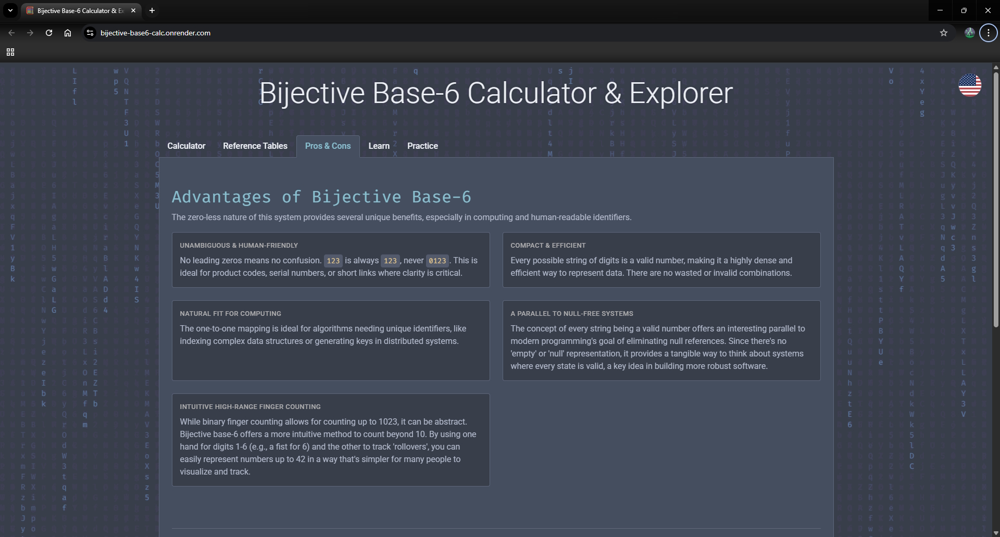

# Bijective Base-6 Calculator & Explorer

[](https://bijective-base6-calc.onrender.com)
[](https://fastapi.tiangolo.com/)
[](https://www.python.org/)
[](https://github.com/tripping-alien/bijective_base6_calc/blob/main/LICENSE)

An interactive web app for exploring the **bijective base-6 number system**—a system with no zero. This educational tool features a hands-on calculator, a live number system converter, detailed explanations, and a configurable practice mode, all presented in a clean, Nord-inspired dark theme.

### [➡️ View the Live Demo](https://bijective-base6-calc.onrender.com)

---



---

## Table of Contents

- [Features](#-features)
- [What is Bijective Base-6?](#-what-is-bijective-base-6)
- [Tech Stack & Rationale](#-tech-stack--rationale)
- [Running Locally](#-running-locally)
- [Contributing](#-contributing)
- [License](#-license)

---

## ✨ Features

- **Live Conversion Explorer**: Instantly see any decimal number represented in Decimal, Binary, Hexadecimal, and Bijective Base-6.
- **All-in-One Calculator**: Enter two bijective numbers and get the results for Addition, Subtraction, Multiplication, and Division at once.
- **Pros & Cons Analysis**: A dedicated tab that clearly explains the advantages and disadvantages of using a bijective system.
- **In-Depth Learning**: Detailed explanations of the conversion algorithm, its connection to formal language theory, and its geometric interpretation as an infinite tree.
- **Configurable Practice Mode**: Test your skills with math or conversion problems across Easy, Medium, and Hard difficulty levels.
- **Full Internationalization**: Core support for English and Russian, with a cross-browser compatible flag selector.
- **Polished UI**: A clean, responsive "Nord" theme that's easy on the eyes, with subtle animations for a better user experience.

---

## 💡 What is Bijective Base-6?

This application is an educational tool for exploring **bijective base-6 numeration**. Unlike standard number systems, it has two key properties:

1.  **No Zero**: The digits are `1, 2, 3, 4, 5, 6`.
2.  **Bijective**: Every positive integer has one, and only one, unique string representation (e.g., `7` is always `11`, never `011`).

Counting proceeds like an odometer that can't show zero. After `6`, the next number "rolls over" to `11`. This property makes it incredibly useful in computer science for creating compact, unambiguous identifiers.

---

## 🛠️ Tech Stack & Rationale

| Technology | Purpose |
| :--- | :--- |
| **Python** | The core language for all backend logic and data generation. |
| **FastAPI** | A modern, high-performance web framework for building the API endpoints. |
| **slowapi** | Provides rate limiting to protect API endpoints from abuse. |
| **pytest** | Used for robust unit and integration testing of the backend logic. |
| **Uvicorn** | The ASGI server that runs the FastAPI application. |
| **HTML5 / CSS3** | For the structure and styling of the user interface, following modern best practices. |
| **Vanilla JavaScript** | Powers all client-side interactivity, including theme switching, API calls, and dynamic content rendering. |
| **Render** | The cloud platform used for free, continuous deployment directly from GitHub. |

---

## 🚀 Running Locally

To get a local copy up and running, follow these simple steps.

### Prerequisites

- Python 3.8+
- An active internet connection to download packages

### Installation

1.  **Clone the repository:**
    ```sh
    git clone https://github.com/tripping-alien/bijective_base6_calc.git
    ```
2.  **Navigate to the project directory:**
    ```sh
    cd bijective_base6_calc
    ```
3.  **Create and activate a virtual environment:**
    - **Windows:**
      ```sh
      python -m venv .venv
      .\.venv\Scripts\Activate.ps1
      ```
    - **macOS / Linux:**
      ```sh
      python3 -m venv .venv
      source .venv/bin/activate
      ```
4.  **Install the required packages:**
    ```sh
    pip install -r requirements.txt
    ```
5.  **Run the application:**
    ```sh
    uvicorn app:app --reload
    ```
6.  **Open your browser** and navigate to `http://127.0.0.1:8000`.

---

## 🤝 Contributing

Contributions, issues, and feature requests are welcome! Feel free to check the issues page.

1.  Fork the Project
2.  Create your Feature Branch (`git checkout -b feature/AmazingFeature`)
3.  Commit your Changes (`git commit -m 'Add some AmazingFeature'`)
4.  Push to the Branch (`git push origin feature/AmazingFeature`)
5.  Open a Pull Request

---

## 📄 License

Distributed under the MIT License. See `LICENSE` for more information.
